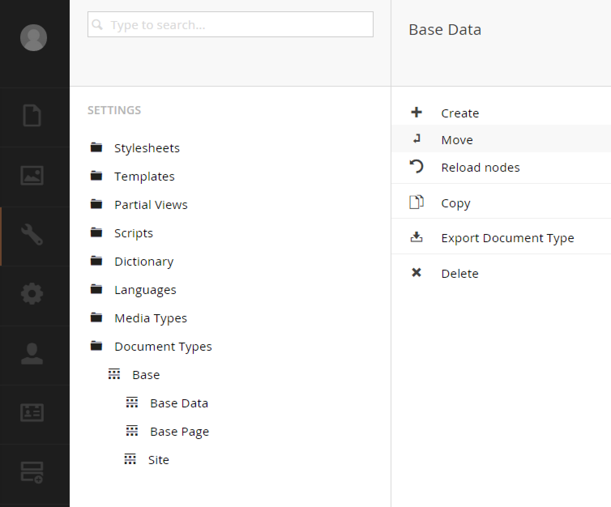
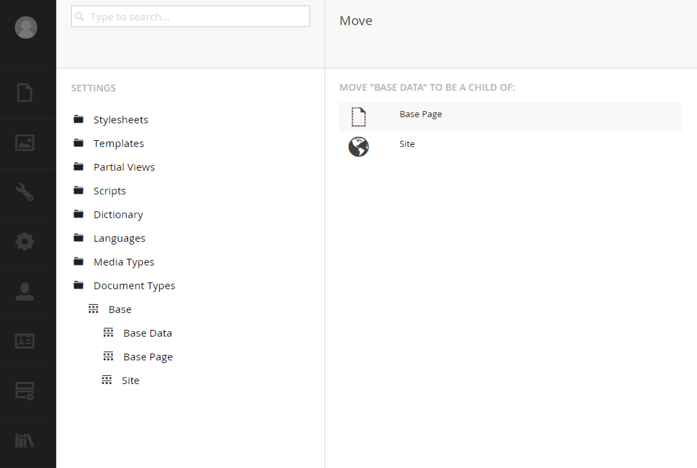

# DocumentTypeMover

An Umbraco plugin that adds Document Type 'move' functionality to the version 7 backoffice.

At present, it is safe to move a document type 'down' as a child of an existing sibling.  This facilitates that type of move.

Perhaps additional functionality can be added later.

##Build
Open project and build the DLL.

Merge the `/App_Plugins` directory with your main Umbraco's plugin folder.

##URL Rewrite
Because the move action will be looking for the template at `umbraco/views/nodeTypes/move.html`, I'm using a simple workaround to get it to route to the `App_Plugins` folder.  Add this to your `urlrewriting.config`:

```
    <add name="document-type-mover"
      virtualUrl="^~/umbraco/views/nodeTypes/move.html"
      rewriteUrlParameter="ExcludeFromClientQueryString"
      destinationUrl="~/App_Plugins/DocumentTypeMover/views/move.html"
      ignoreCase="true" />
```

If popular enough, I can create an installable package.




